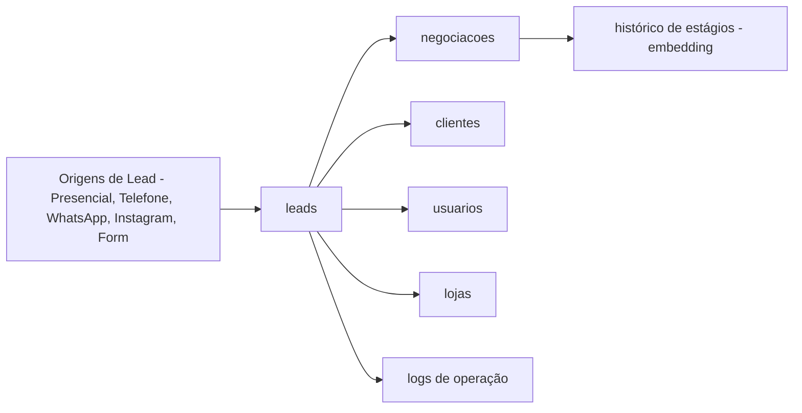

# FATEC - BDN 2026/1 - Sistema de Gestão de Leads (MongoDB)

Repositório da atividade de Banco de Dados Não Relacional (MongoDB), tema **1000 Valle Multimarcas**.

## Estrutura

- `Requisitos-ABP/README.md`: guia de entrega da atividade.
- `documentacao/modelagem.c4`: índice da arquitetura C4.
- `documentacao/c4/`: diagramas C4 quebrados por nível para melhor renderização.
- `documentacao/justificativas.md`: decisões de embedding/referencing e vantagens do modelo.
- `documentacao/consultas-e-aggregations.md`: consultas obrigatórias e pipelines de dashboard.

## Escopo da Entrega

- Coleções obrigatórias: `clientes`, `leads`, `usuarios`, `negociacoes`, `logs`, `lojas`.
- Regras de negócio atendidas (lead-cliente, lead-loja-atendente, negociação ativa única, histórico, status/estágio).
- Consultas com filtros, projeção, ordenação e paginação.
- Aggregations para indicadores gerenciais.

## Visão Rápida da Solução

## Como Usar

1. Utilizar `documentacao/modelagem.c4` como guia de estrutura e relações.
2. Usar `documentacao/consultas-e-aggregations.md` como base das consultas obrigatórias e dashboard.
3. Consolidar justificativas em `documentacao/justificativas.md`.
4. Gerar prints em tela inteira e consolidar no PDF `BDN-Documento-ABP.pdf`.

