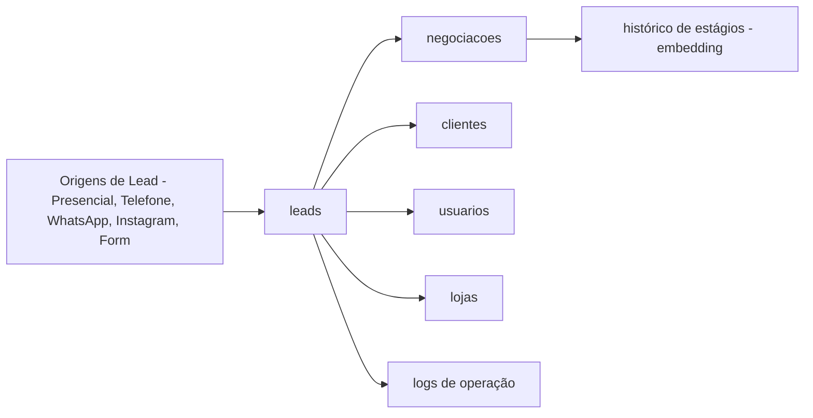

# FATEC - BDN 2026/1 - Sistema de Gestão de Leads (MongoDB)

Repositório da atividade de Banco de Dados Não Relacional (MongoDB), tema **1000 Valle Multimarcas**.

## Estrutura

- `Requisitos-ABP/`: **documentação principal da entrega** (script, modelagem, justificativas, consultas).
- `Requisitos-ABP/BDN-Documento-ABP.md`: índice consolidado do projeto.
- `Requisitos-ABP/script-mongodb.js`: script MongoDB executável completo.
- `docs/entregas/PDFs/`: PDFs com prints por dia de aula.
- `documentacao/c4/`: diagramas C4 quebrados por nível para melhor renderização.
- `documentacao/justificativas.md`: cópia/resumo das justificativas (ver também `Requisitos-ABP/`).
- `documentacao/consultas-e-aggregations.md`: consultas e aggregations (ver também `Requisitos-ABP/`).

## Escopo da Entrega

- Coleções obrigatórias: `clientes`, `leads`, `usuarios`, `negociacoes`, `logs`, `lojas`.
- Regras de negócio atendidas (lead-cliente, lead-loja-atendente, negociação ativa única, histórico, status/estágio).
- Consultas com filtros, projeção, ordenação e paginação.
- Aggregations para indicadores gerenciais.

## Visão Rápida da Solução

## Como Usar

1. Utilizar os arquivos em `documentacao/c4/` como guia de estrutura e relações.
2. Usar `documentacao/consultas-e-aggregations.md` como base das consultas obrigatórias e dashboard.
3. Consolidar justificativas em `documentacao/justificativas.md`.
4. Gerar prints em tela inteira e consolidar no PDF `BDN-Documento-ABP.pdf`.

