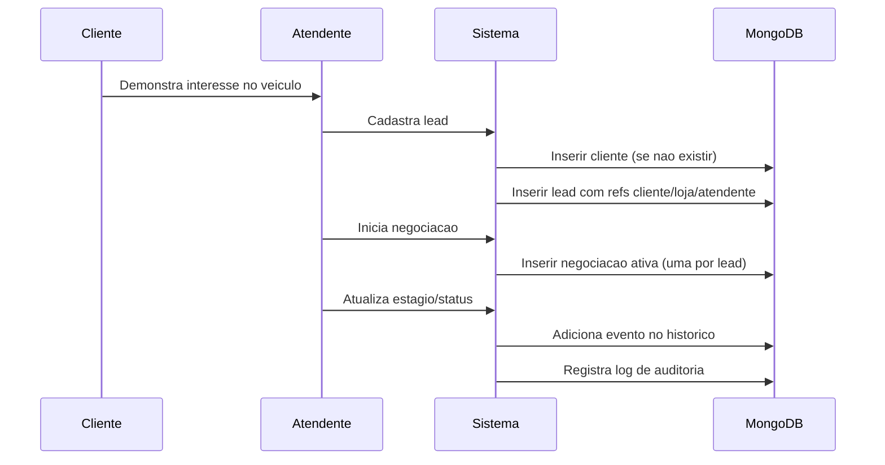
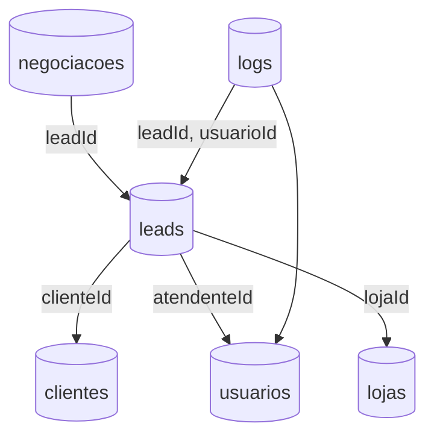
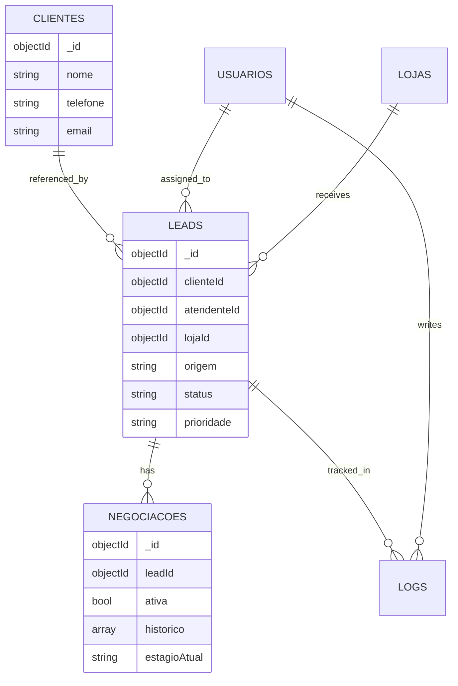

# Dia 1 (04/05/26) - Leitura do problema e definicao das colecoes

## 1) Leitura do problema

O projeto tem como objetivo modelar, em MongoDB, um sistema de gestao de leads para a 1000 Valle Multimarcas.
O fluxo principal envolve captacao de leads por diferentes canais, distribuicao para atendentes por loja, acompanhamento de negociacoes e registro de historico operacional.
O banco precisa suportar:

- rastreabilidade do ciclo de vida do lead;
- associacao clara entre lead, cliente, loja e atendente;
- controle de status e estagios de negociacao;
- consultas operacionais e indicadores gerenciais via aggregation.

## 2) Definicao das colecoes

As colecoes obrigatorias definidas para o escopo da atividade sao:

1. `clientes`
2. `leads`
3. `usuarios`
4. `negociacoes`
5. `logs`
6. `lojas`

### 2.1 Campos principais por colecao

#### `clientes`
- `_id`
- `nome`
- `telefone`
- `email`

#### `leads`
- `_id`
- `clienteId` (ref. `clientes._id`)
- `atendenteId` (ref. `usuarios._id`)
- `lojaId` (ref. `lojas._id`)
- `origem`
- `status`
- `prioridade`
- `createdAt`

#### `usuarios`
- `_id`
- `nome`
- `email`
- `perfil` (atendente, gerente, admin)
- `ativo`

#### `negociacoes`
- `_id`
- `leadId` (ref. `leads._id`)
- `ativa` (garantir apenas uma ativa por lead)
- `estagioAtual`
- `historico` (embedding de eventos: estagio/status, data, responsavel)

#### `logs`
- `_id`
- `leadId` (ref. `leads._id`)
- `usuarioId` (ref. `usuarios._id`)
- `acao`
- `detalhes`
- `createdAt`

#### `lojas`
- `_id`
- `nome`
- `cidade`
- `estado`
- `ativo`

## 3) Relacionamentos e regra de modelagem

- `leads` referencia `clientes`, `usuarios` e `lojas` para evitar redundancia.
- `negociacoes` referencia `leads`.
- `negociacoes.historico` usa embedding por ser dependente da negociacao e lido em conjunto.
- `logs` registra a trilha de auditoria operacional.

## 4) Regras obrigatorias atendidas no desenho

- Cada lead vinculado a um cliente.
- Cada lead vinculado a uma loja e a um atendente.
- Apenas uma negociacao ativa por lead.
- Historico de negociacao registrado.
- Controle de status e estagio.

## 5) Diagramas de apoio

### 5.1 Fluxo principal (lead -> negociacao -> log)

### 5.2 Componentes de dados (colecoes e referencias)

### 5.3 Modelo ER orientado a MongoDB

