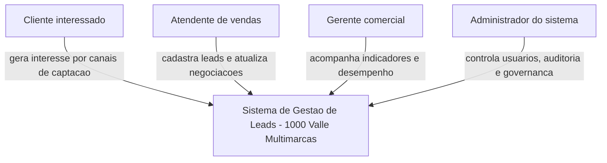
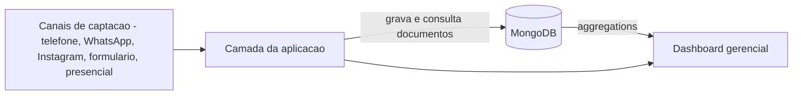
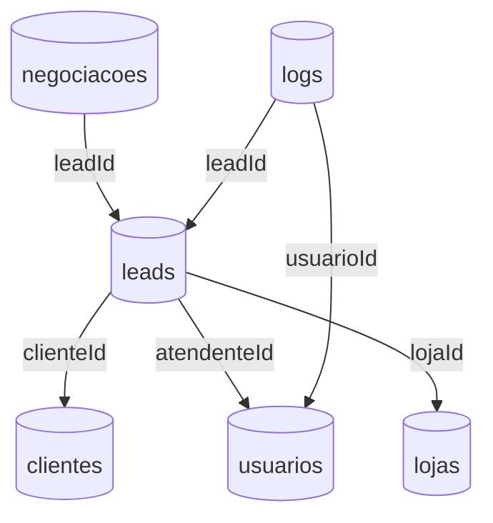
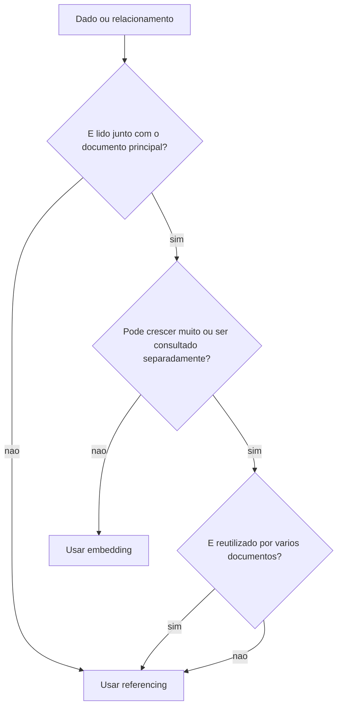
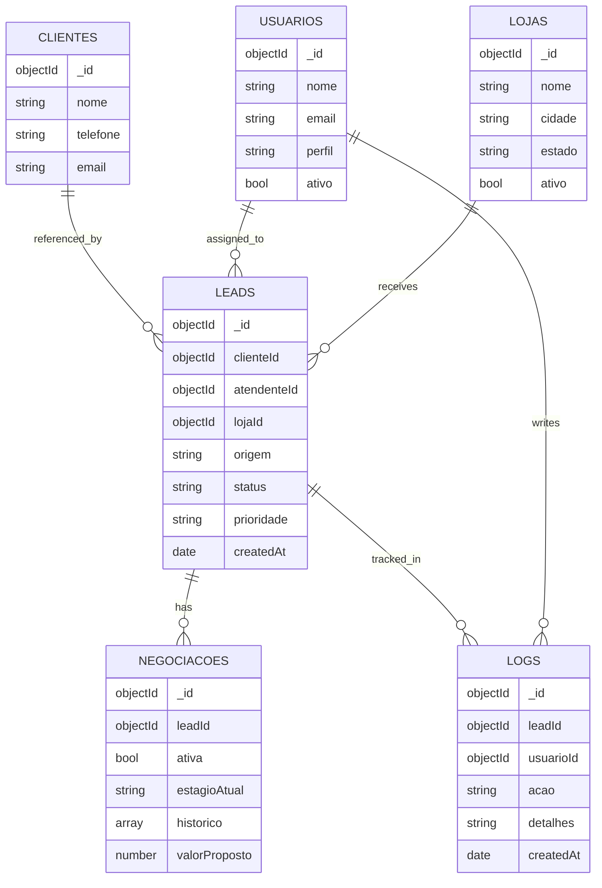
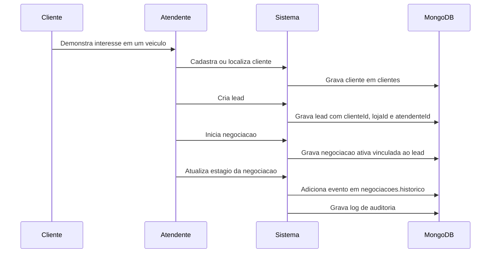

# Dia 2 (11/05/26) - Modelagem MongoDB e Embedding vs Referencing

## 1) Objetivo da modelagem

A modelagem MongoDB do sistema de gestao de leads da 1000 Valle Multimarcas foi definida para apoiar o ciclo comercial completo:

- cadastro e qualificacao de leads;
- vinculo do lead com cliente, loja e atendente;
- acompanhamento da negociacao ativa;
- registro do historico da negociacao;
- auditoria das acoes realizadas;
- consultas operacionais e indicadores gerenciais.

O desenho prioriza consultas frequentes do funil comercial, rastreabilidade das operacoes e reducao de redundancia entre entidades reutilizadas.

## 2) Visao C4 - Contexto



## 3) Visao C4 - Container



## 4) Colecoes do modelo

As colecoes principais permanecem as mesmas definidas no Dia 1:

1. `clientes`
2. `leads`
3. `usuarios`
4. `negociacoes`
5. `logs`
6. `lojas`

### 4.1 Responsabilidade de cada colecao

#### `clientes`
Armazena os dados cadastrais do cliente interessado.

Campos principais:
- `_id`
- `nome`
- `telefone`
- `email`

#### `leads`
Representa a oportunidade comercial gerada a partir do interesse de um cliente.

Campos principais:
- `_id`
- `clienteId` (ref. `clientes._id`)
- `atendenteId` (ref. `usuarios._id`)
- `lojaId` (ref. `lojas._id`)
- `origem`
- `status`
- `prioridade`
- `createdAt`

#### `usuarios`
Representa atendentes, gerentes e administradores do sistema.

Campos principais:
- `_id`
- `nome`
- `email`
- `perfil`
- `ativo`

#### `negociacoes`
Registra o processo comercial de um lead.

Campos principais:
- `_id`
- `leadId` (ref. `leads._id`)
- `ativa`
- `estagioAtual`
- `historico` (eventos embutidos)
- `valorProposto`

#### `logs`
Registra a trilha de auditoria das operacoes realizadas.

Campos principais:
- `_id`
- `leadId` (ref. `leads._id`)
- `usuarioId` (ref. `usuarios._id`)
- `acao`
- `detalhes`
- `createdAt`

#### `lojas`
Representa as unidades da 1000 Valle Multimarcas.

Campos principais:
- `_id`
- `nome`
- `cidade`
- `estado`
- `ativo`

## 5) Visao C4 - Componentes de dados



## 6) Embedding vs Referencing

No MongoDB, a decisao entre embutir documentos ou referenciar colecoes depende do padrao de leitura, crescimento dos dados e independencia das entidades.

### 6.1 Onde usamos Embedding

Usamos embedding em `negociacoes.historico`.

Exemplo de estrutura:

```javascript
{
  _id: ObjectId("..."),
  leadId: ObjectId("..."),
  ativa: true,
  estagioAtual: "proposta_enviada",
  historico: [
    {
      estagio: "contato_inicial",
      status: "em_atendimento",
      observacao: "Cliente demonstrou interesse em SUV.",
      responsavelId: ObjectId("..."),
      createdAt: ISODate("2026-05-11T10:00:00Z")
    },
    {
      estagio: "proposta_enviada",
      status: "em_negociacao",
      observacao: "Proposta enviada pelo atendente.",
      responsavelId: ObjectId("..."),
      createdAt: ISODate("2026-05-11T11:30:00Z")
    }
  ]
}
```

Motivos:

- o historico pertence diretamente a uma negociacao;
- os eventos do historico sao consultados junto com a negociacao;
- a leitura fica mais simples e rapida;
- evita consultas extras para montar a linha do tempo da negociacao.

### 6.2 Onde usamos Referencing

Usamos referencing nos relacionamentos entre entidades que podem ser reutilizadas, alteradas de forma independente ou crescer em colecoes separadas.

Referencias definidas:

- `leads.clienteId -> clientes._id`
- `leads.atendenteId -> usuarios._id`
- `leads.lojaId -> lojas._id`
- `negociacoes.leadId -> leads._id`
- `logs.leadId -> leads._id`
- `logs.usuarioId -> usuarios._id`

Motivos:

- um cliente pode gerar mais de um lead ao longo do tempo;
- um atendente pode cuidar de muitos leads;
- uma loja recebe muitos leads;
- logs podem crescer bastante e devem ficar separados;
- evita duplicacao de dados cadastrais;
- reduz risco de inconsistencias quando clientes, usuarios ou lojas forem atualizados.

## 7) Diagrama de decisao da modelagem



## 8) Modelo ER orientado a MongoDB



## 9) Fluxo principal com MongoDB



## 10) Regras atendidas pela modelagem

- Cada lead fica vinculado a um cliente por `clienteId`.
- Cada lead fica vinculado a uma loja por `lojaId`.
- Cada lead fica vinculado a um atendente por `atendenteId`.
- Cada negociacao fica vinculada a um lead por `leadId`.
- O historico da negociacao fica registrado por embedding em `negociacoes.historico`.
- Os logs ficam separados para auditoria e crescimento independente.
- A regra de apenas uma negociacao ativa por lead deve ser garantida pela aplicacao e por indice unico parcial.

## 11) Indices recomendados

```javascript
db.leads.createIndex({ clienteId: 1 });
db.leads.createIndex({ atendenteId: 1 });
db.leads.createIndex({ lojaId: 1 });
db.leads.createIndex({ status: 1, createdAt: -1 });
db.negociacoes.createIndex(
  { leadId: 1, ativa: 1 },
  { unique: true, partialFilterExpression: { ativa: true } }
);
db.logs.createIndex({ leadId: 1, createdAt: -1 });
db.logs.createIndex({ usuarioId: 1, createdAt: -1 });
```

## 12) Conclusao

A modelagem combina referencing para entidades principais e embedding para o historico interno da negociacao.
Essa decisao atende ao fluxo de vendas da 1000 Valle Multimarcas porque mantem os dados cadastrais normalizados, reduz duplicidade e permite consultar a negociacao com sua linha do tempo em um unico documento.
