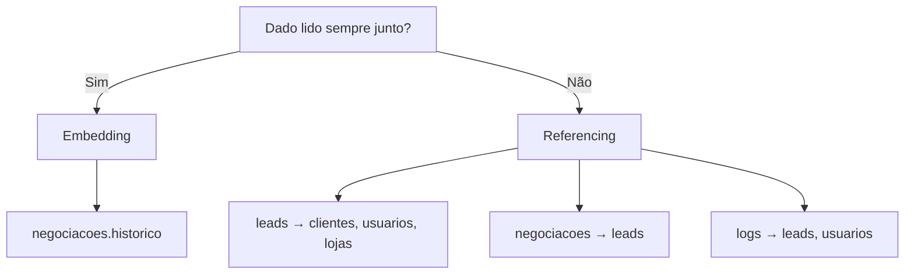

# Justificativas de Modelagem — 1000 Valle Multimarcas

## Contexto

O desafio original foi projetado para banco relacional. Adaptamos para MongoDB priorizando leitura do funil comercial, histórico de negociação e indicadores gerenciais com aggregation pipeline.

---

## Onde utilizamos Embedding e por quê

| Local | Estrutura | Motivo |
|-------|-----------|--------|
| `negociacoes.historico` | Array de eventos `{ data, etapa, observacao }` | O histórico é sempre lido junto com a negociação; cresce de forma previsível; evita joins em consultas operacionais do atendente |

**Exemplo:**

```javascript
historico: [
  { data: ISODate("2026-05-18T11:25:00Z"), etapa: "primeira proposta", observacao: "Negociação em andamento" },
  { data: ISODate("2026-05-18T12:00:00Z"), etapa: "contraproposta", observacao: "Cliente pediu desconto" }
]
```

---

## Onde utilizamos Referencing e por quê

| Referência | Motivo |
|------------|--------|
| `leads.clienteId → clientes._id` | Cliente é entidade reutilizável; um cliente pode gerar vários leads |
| `leads.atendenteId → usuarios._id` | Atendentes atendem muitos leads; dados do usuário mudam independentemente |
| `leads.lojaId → lojas._id` | Loja é cadastro centralizado compartilhado entre leads |
| `negociacoes.leadId → leads._id` | Negociação pertence a um lead; permite histórico de negociações encerradas |
| `logs.leadId` e `logs.usuarioId` | Auditoria referencia entidades sem duplicar cadastro |

Referencing evita redundância e inconsistência quando clientes, usuários ou lojas são atualizados.

---

## Regras de negócio implementadas

| Regra | Implementação |
|-------|---------------|
| Lead vinculado a cliente | Campo `clienteId` obrigatório em `leads` |
| Lead vinculado a loja e atendente | Campos `lojaId` e `atendenteId` em `leads` |
| Apenas uma negociação ativa por lead | Campo `ativo: true/false` + índice único parcial em `{ leadId: 1 }` com `partialFilterExpression: { ativo: true }` |
| Histórico de negociação | Array embutido em `negociacoes.historico` |
| Controle de status e estágio | `leads.status` (funil) e `negociacoes.estagioAtual` (processo comercial) |

---

## Vantagens do modelo não relacional neste contexto

1. **Flexibilidade de schema** — novos campos (ex.: `importancia`, `canalSecundario`) sem migração pesada.
2. **Escrita rápida de eventos** — append no array `historico` sem transações multi-tabela.
3. **Dashboard nativo** — aggregation pipeline (`$match`, `$group`, `$project`) para KPIs gerenciais.
4. **Aderência ao domínio** — funil comercial com estágios dinâmicos e eventos sequenciais.

---

## Trade-offs aceitos

- Validação de integridade referencial fica a cargo da aplicação (MongoDB não impõe FK).
- Índices são necessários para manter performance em consultas analíticas.
- Joins entre coleções (`$lookup`) são mais custosos que leitura de documento embutido.

---

## Decisão: Embedding vs Referencing (resumo)


