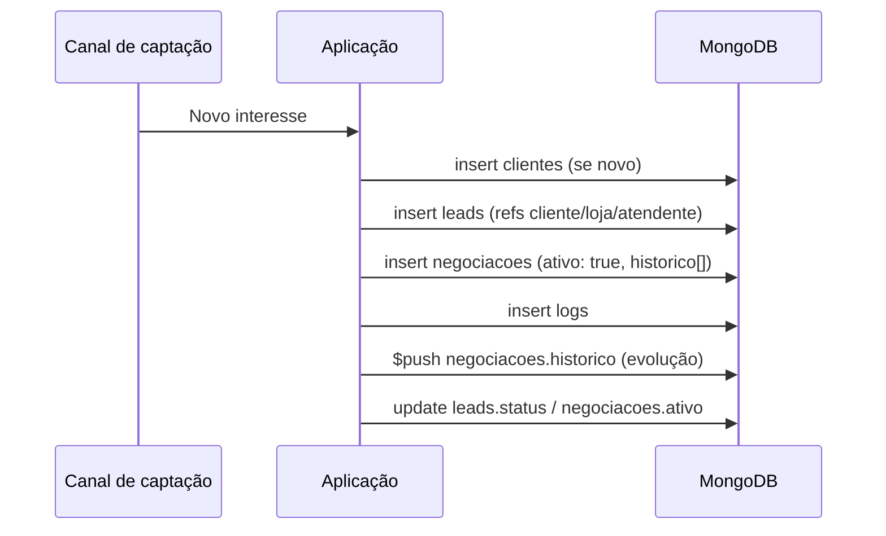

# Modelagem MongoDB — 1000 Valle Multimarcas

Database: `valle_leads`

---

## Coleção: `lojas`

```javascript
{
  _id: ObjectId,
  nome: String,
  endereco: String,
  telefone: String,
  createdAt: Date
}
```

---

## Coleção: `usuarios`

Atendentes, gerentes e administradores.

```javascript
{
  _id: ObjectId,
  nome: String,
  cargo: String,          // "Atendente", "Gerente Comercial", "Admin"
  perfil: String,         // "atendente", "gerente", "admin"
  area: String,
  email: String,
  telefone: String,
  ativo: Boolean,
  createdAt: Date
}
```

---

## Coleção: `clientes`

```javascript
{
  _id: ObjectId,
  nome: String,
  cpf: String,
  telefone: String,
  email: String,
  createdAt: Date
}
```

**Referenciado por:** `leads.clienteId`

---

## Coleção: `leads`

Oportunidade comercial — núcleo do funil.

```javascript
{
  _id: ObjectId,
  nomeLead: String,
  clienteId: ObjectId,    // ref → clientes._id
  lojaId: ObjectId,       // ref → lojas._id
  atendenteId: ObjectId,  // ref → usuarios._id
  origem: String,         // whatsapp | instagram | telefone | presencial | formulario
  status: String,         // novo | em_atendimento | convertido | perdido
  importancia: String,    // alta | media | baixa
  createdAt: Date
}
```

---

## Coleção: `negociacoes`

Processo comercial vinculado a um lead.

```javascript
{
  _id: ObjectId,
  leadId: ObjectId,       // ref → leads._id
  status: String,         // aberta | em_negociacao | convertido | perdido
  estagioAtual: String,   // qualificacao | proposta | fechamento | desistencia
  valorProposto: Number,
  valorFinal: Number | null,
  ativo: Boolean,         // true = negociação ativa (máx. 1 por lead)
  historico: [            // EMBEDDING
    {
      data: Date,
      etapa: String,
      observacao: String
    }
  ],
  createdAt: Date
}
```

**Índice único parcial:**

```javascript
db.negociacoes.createIndex(
  { leadId: 1 },
  { unique: true, partialFilterExpression: { ativo: true } }
);
```

---

## Coleção: `logs`

Auditoria de operações.

```javascript
{
  _id: ObjectId,
  entidade: String,       // "lead" | "negociacao"
  operacao: String,       // "criacao" | "atualizacao"
  usuarioId: ObjectId,    // ref → usuarios._id
  leadId: ObjectId,       // ref → leads._id
  referenciaId: ObjectId, // _id da entidade afetada
  descricao: String,
  createdAt: Date
}
```

---

## Índices recomendados

```javascript
db.leads.createIndex({ clienteId: 1 });
db.leads.createIndex({ lojaId: 1 });
db.leads.createIndex({ atendenteId: 1 });
db.leads.createIndex({ status: 1, createdAt: -1 });
db.leads.createIndex({ createdAt: -1 });

db.negociacoes.createIndex({ leadId: 1 });
db.negociacoes.createIndex(
  { leadId: 1 },
  { unique: true, partialFilterExpression: { ativo: true } }
);

db.logs.createIndex({ referenciaId: 1, createdAt: -1 });
db.logs.createIndex({ usuarioId: 1, createdAt: -1 });
```

---

## Fluxo principal


