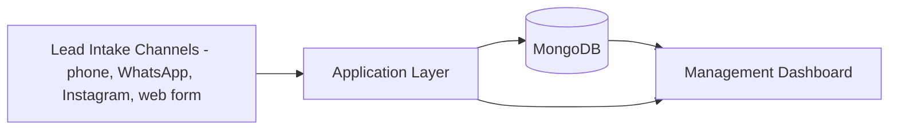

# C4 Level 2 - Container

```mermaid
flowchart LR
    Intake["Lead Intake Channels - phone, WhatsApp, Instagram, web form"]
    AppLayer[Application Layer]
    Mongo[(MongoDB)]
    Dashboard[Management Dashboard]

    Intake --> AppLayer
    AppLayer --> Mongo
    Mongo --> Dashboard
    AppLayer --> Dashboard
```

