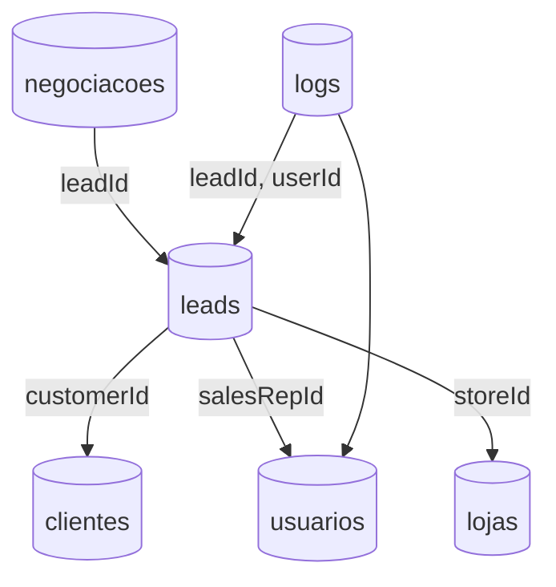

# C4 Level 3 - Component (Data Components)

```mermaid
flowchart TB
    Leads[(leads)]
    Customers[(clientes)]
    Users[(usuarios)]
    Stores[(lojas)]
    Negotiations[(negociacoes)]
    Logs[(logs)]

    Leads -->|customerId| Customers
    Leads -->|salesRepId| Users
    Leads -->|storeId| Stores
    Negotiations -->|leadId| Leads
    Logs -->|leadId, userId| Leads
    Logs --> Users
```

