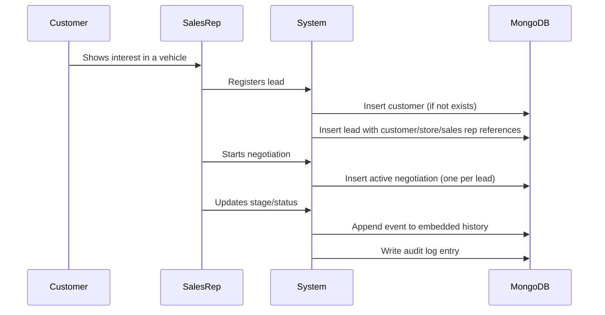

# C4 Level 4 - Code Flow (Main Business Sequence)

```mermaid
sequenceDiagram
    participant Customer
    participant SalesRep
    participant System
    participant MongoDB

    Customer->>SalesRep: Shows interest in a vehicle
    SalesRep->>System: Registers lead
    System->>MongoDB: Insert customer (if not exists)
    System->>MongoDB: Insert lead with customer/store/sales rep references
    SalesRep->>System: Starts negotiation
    System->>MongoDB: Insert active negotiation (one per lead)
    SalesRep->>System: Updates stage/status
    System->>MongoDB: Append event to embedded history
    System->>MongoDB: Write audit log entry
```

