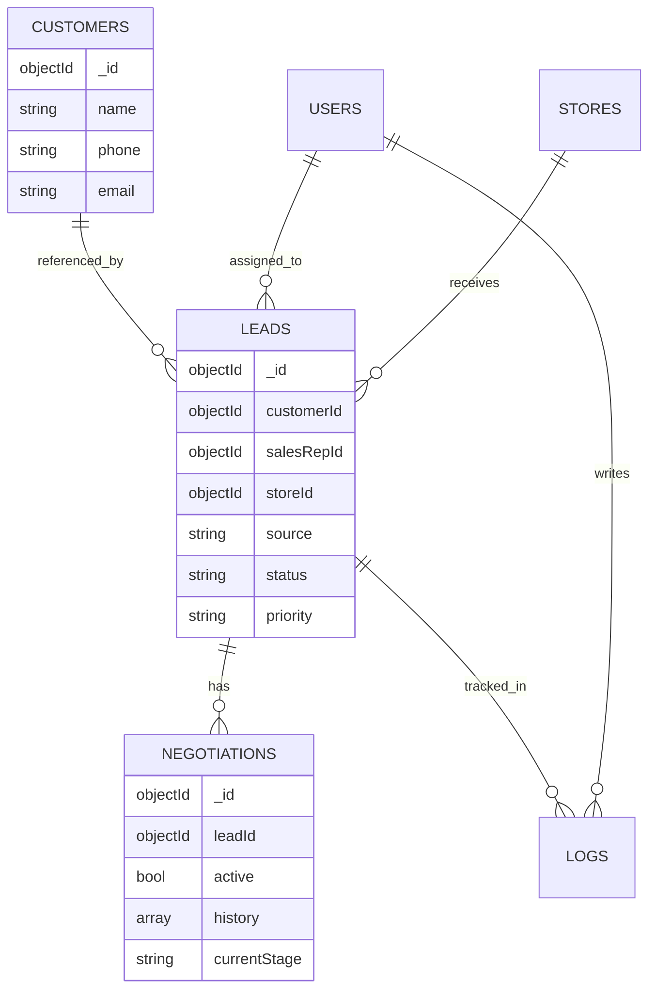

# C4 Data Model - ER View (MongoDB-Oriented)

```mermaid
erDiagram
    CUSTOMERS ||--o{ LEADS : referenced_by
    USERS ||--o{ LEADS : assigned_to
    STORES ||--o{ LEADS : receives
    LEADS ||--o{ NEGOTIATIONS : has
    LEADS ||--o{ LOGS : tracked_in
    USERS ||--o{ LOGS : writes

    CUSTOMERS {
        objectId _id
        string name
        string phone
        string email
    }
    LEADS {
        objectId _id
        objectId customerId
        objectId salesRepId
        objectId storeId
        string source
        string status
        string priority
    }
    NEGOTIATIONS {
        objectId _id
        objectId leadId
        bool active
        array history
        string currentStage
    }
```

